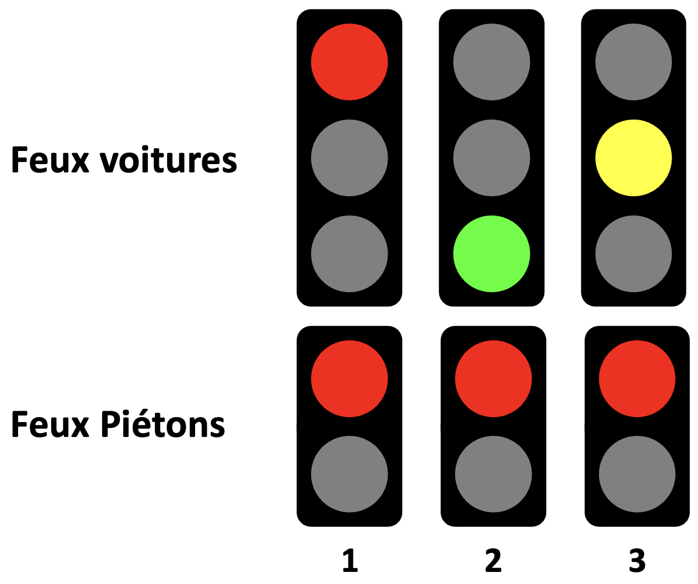
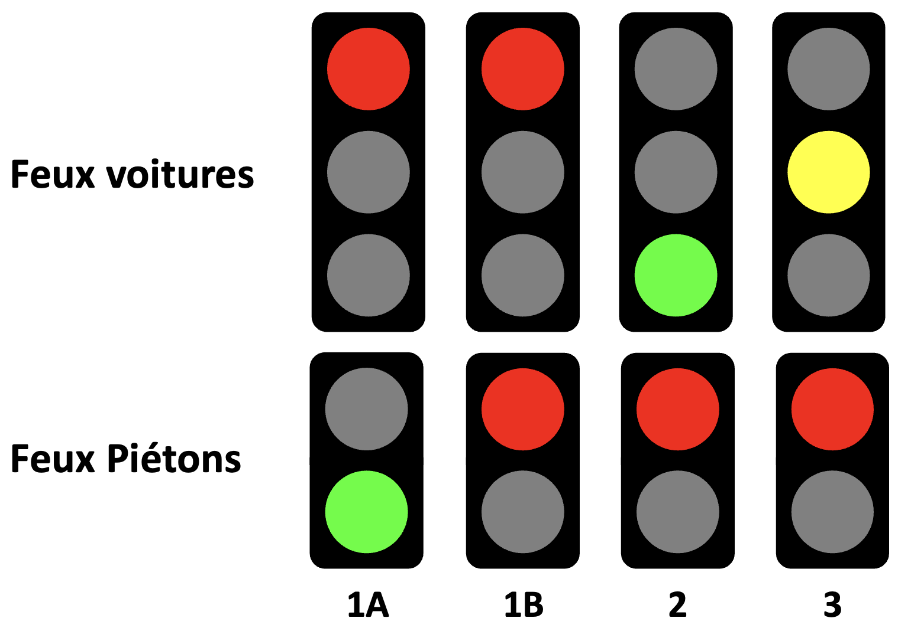

# 420-W48-SF-TP01

## 1 - Directives

### 1.1 - Déroulement du TP

- Remise du travail: jeudi 14 avril 2022, 23:59
- Ce travail est réalisé en équipe de 2 membres et seuls les membres de cette équipe y contribuent
- Toutes les réponses fournies doivent être originales (produites par l’étudiant ou un membre de l’équipe)
- Toute copie de code, de portion de code, d’algorithme ou de texte doit faire mention de sa source
- L’emprunt ou la copie de code ou de portions de code est interdite
- Tout constat de plagiat, tricherie ou fraude sera automatiquement déclaré à la Direction et les sanctions prévues seront appliquées
- Vous devez utiliser utiliser votre dépôt Git pour faire votre travail : si une situation particulière est détectée, vos commits moduleront votre note dans le groupe

## 1.2 - À remettre sur la plateforme d'enseignement Léa

- Un document word contenant le détail du projet
- Votre code source C++ avec la structure de PlatformIO
- Vous devez fournir le lien d'une vidéo de 5 minutes illustrant le circuit, le code et le fonctionnement :
  - La vidéo doit être déposée sur YouTube
  - En lien non listé
  - La vidéo doit être accessible jusqu'à un an après la remise du travail
  - La vidéo doit être en français

### 1.3 - Structure de la remise

- Vous devez remplir le fichier "AUTHORS.md".
  Il donne le nom et matricule des équipiers
- Votre code source doit être dans le répertoire  ```src``` du présent dépôt Git
- Le répertoire source doit suivre la structure d’un projet Platform.io
- Le lien de la vidéo doit indiqué dans le document word et dans le fichier "AUTHORS.md"
- Le répertoire ```documents``` doit contenir votre rapport de TP

## 2 - Description du projet

La municipalité de « LongueVie » désire mettre en place un système de signalisation par feux de circulation. De nombreuses collisions entre véhicules et accidents impliquant des piétons blessés gravement sont survenus depuis l’élargissement de la chaussée à quatre voies.

Le « directeur de la sécurité routière de la municipalité »  vous a donc octroyé un mandat pour mettre en place un système de gestion des feux de circulation en remplacement des panneaux d’arrêt.

Votre tâche générale consiste à mettre en place, un programme de gestion du contrôle de la circulation.

Ce système comprend :

- Un « feu de circulation automobile » (ci-après nommé FeuxAutos) composé de 3 DELs (une rouge, une jaune et une verte) pour les véhicules automobiles
- Un « feu de piétons » (ci-après nommé FeuxPiétons) composé de 2 DELs (une rouge et une verte). Le FeuPiétons est commandé par des boutons placés de chaque côté de la chaussé
- Un microcontrôleur Arduino UNO et une carte de circuit électronique contenant les composants pour le bon fonctionnement du système
- Un document technique

### 2.1 - Mise en place des feux de circulation

FeuxAutos utilise le cycle rouge (1), vert (2) et jaune (3) :



Quand un piéton appuie sur le bouton d’appel, sa demande est mémorisée dans le système. Quand le feu passe au rouge, on valide si une demande est en cours, si c’est le cas, on passe FeuxPiétons au vert pendant une certaine durée déterminée (1A). Le feu piéton passe ensuite au rouge pendant une autre durée déterminée (1B) et le cycle des feux automobile recommence (2, 3) :



On voit ici que l’état 1 du cycle sans piéton a été transformé en deux états 1A et 1B.

Si le feu automobile est rouge durant la pression du bouton de piéton, le piéton doit attendre la prochaine validation au début du prochain cycle.

Pour les besoins de la simulation, les temps choisis sont :

| État | Durée (sec.) | FeuxAutos | FeuxPiétons |
| --- | --- | --- | --- |
| 1 | 15 | Rouge | Rouge |
| 1A | 20 | Rouge | Vert |
| 1B | 10 | Rouge | Rouge |
| 2 | 30 | Vert | Rouge |
| 3 | 5 | Jaune | Rouge |

### 2.2. - Analyse statistique

La municipalité veut connaître l'achalandage des piétons dans les rues et propose comme première approche de pouvoir afficher le pourcentage de nombre de cycle piéton par rapport au nombre de cycle automobile.

Ce pourcentage ne doit pas être réinitialisé à chaque redémarrage du système de contrôle de l'artaire de circulation.

Dans votre document d'analyse, vous devez expliqué comment vous vous y prenez pour résoudre ce problème et vous devez aussi expliquer quelles sont les limites de votre système.

Vous devez trouver un moyen d'afficher facilement le pourcentage au démarrage du système et sur demande. Vous devez également trouver un moyen de réinitialiser le pourcentage à 0.

## 2 - Détail de l'évaluation

### 2.1 - Répartition des points

Vous pourrez faire le travail individuellement ou en équipe de 2 personnes, au maximum. Cette règle pourra être modifiée sur accord avec les formateurs. Dans ce dernier-cas, le document doit indiquer les tâches respectives que chaque personne aura fait.

1. Document de présentation du projet : (Contexte : 15%, Circuit : 20%, Coût : 5% = 40%)
   - Contexte du projet
   - Planification, attribution des tâches
   - La forme pourra être un texte explicatif ou un schéma hiérarchique des différentes étapes du projet
   - Dessiner un schéma du circuit
   - Diagramme de classes
   - Inventaire des pièces : estimation des coûts des pièces
   - Estimation énergétique : durée de vie des batteries / consommation si sur secteur
   - Schéma technique avec explications

2. Vidéo de présentation (Présentation : 3%, Explication : 4%, Fonctionnement : 3% = 10%)
   - Projet
   - Circuit
   - Feux / boutons
   - Pièces
   - Les différents états / séquences
   - Statistiques

3. Registre des heures consacrées au projet (5%). Le registre contient la liste des activités et le temps consacré à chaque activité et identifié au participant concerné
4. Code (Cycles : 20%, Appels : 10%, Achalandage : 15% = 45%)

### 2.2 - Critères appliqués durant l'évaluation

L'évaluation du travail est effectuée par les enseignants de l'UE en se basant sur :

- L'historique de Git et de Teams/Sharepoint font office de référence pour évaluer la proportion du travail effectué par chaque équipier

- La qualité et le contenu du code source :

  - Conformité du code et des normes d'écriture utilisées dans le cours
  - Respect des bonnes pratiques
  - Fonctionnalité du code
  - Facilité de lecture du code
  - Modularité
  - Modularité et utilisation adéquate de la POO
  - Modèle objet
  - Paramétrisation du code
  - Utilisation de constantes
  - Utilisation de fichiers de configuration
  - Optimisation de la mémoire
  - Bonne utilisation des contraintes matérielles
  - Bonne utilisation des bibliothèques
  - etc.

- La qualité et le contenu du document word :
  
  - Français
  - Schéma électrique et diagramme de classes
  - Clarté et précision des explications
  - Mise en page
  - Page de présentation
  - etc.

- La qualité et le contenu de la présentation vidéo :

  - Vidéo
  - Audio
  - Explication orale
  - etc.

Tout partage de code, d'explication, de bouts de texte, etc. est considéré comme du plagiat. Pour plus de détails, consultez le site (et ses vidéos) [Sois intègre du Cégep de Sainte-Foy](http://csfoy.ca/soisintegre) ainsi que [l'article 6.1.12 de la PÉA](https://www.csfoy.ca/fileadmin/documents/notre_cegep/politiques_et_reglements/5.9_PolitiqueEvaluationApprentissages_2019.pdf)

## 3 - Matériel dans l’inventaire de l’entreprise

Le budget se limite au matériel. Le temps alloué et le temps de montage sur plaque de circuit est exclus. Tous les prix sont fictifs.

Ajoutez des éléments et des prix au besoin (prix fictifs)

| Composant | Description | Nombre / lot | Prix ($ CAD)(*) |
| --- | --- | --- | --- |
| Résistance ¼ W | Jusqu’à 999 Ω | 4 | 0,15 $ |
| Résistance ½ W | Jusqu’à 999 Ω | 4 | 0,25 $ |
| Résistance ¼ W | > 999 Ω | 4 | 0,35 $ |
| Résistance variable | Toutes valeurs | 1 | 0,25 $ |
| Fils cavaliers | Longueur/couleur variées | 4 | 0,05 $ |
| Natte Dupont | Mâle-Mâle | 4 | 0,15 $ |
| Natte Dupont | Mâle-Femelle | 4 | 0,15 $ |
| Natte Dupont | Femelle-Femelle | 4 | 0,20 $ |
| Bornier 16 broches | Mâle-Mâle | 1 | 0,05 $ |
| Bornier 8 broches | Mâle-Femelle | 1 | 0,10 $ |
| Bornier 16 broches | Mâle-Mâle | 1 | 0,05 $ |
| Bornier 8 broches | Mâle-Femelle | 1 | 0,10 $ |
| Plaquette pour soudure | Fabriquée selon schéma fourni | 1 | 5,00 $ |
| Afficheur Volt/Ampère | 0-99 V /0-2 A | 1 | 15,00$ |

(*) Tableau fictif, à des fins pédagogiques seulement
